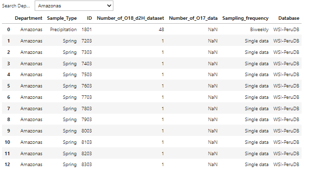

# WSI-PeruDB [](https://zenodo.org/doi/10.5281/zenodo.10558511)
This package allows users to access the Water Stable Isotope Database in Peru. It includes 464 stations over Peru, updated until 2023, and provides an interactive map for exploring the spatial distribution of all the stations. Additionally, it offers features for technical validation and display temporal series for each station and department across Peru.

## How to use it 
Before installing the WSIPeruDB package, users must create a new environment and install either the notebook version 6.5.2 or jupyterlab version 3.5.3
```
conda install notebook=6.5.2
```
or 
```
conda install jupyterlab=3.5.3
```
Then, users can install the package WSIPeruDB: 

```
pip install WSIPeruDB
```
After that, in order to view the spatial distribution of stable isotope stations, users must run the following command: 

```
import WSIPeruDB
WSIPeruDB.generate_map()
```
<div align="left">
    
  </a>
    
To get information from every department, users must import the 'department_information' module. This allows them to check if the dataset is stored in the WSIPeruDB or in another database.
    
```
WSIPeruDB.department_information()
```
<div align="left">
    
  </a>

In order to plot the Linear Meteoric Water Line (LMWL) for every station, department, and sample type, users must run the following command:

```
WSIPeruDB.plot_lmwl()
```


The temporal series for every station and histogram for all data in each department, users must run the following commnad: 

```
WSIPeruDB.analyze_temporal_series()
```

WSIPeruDB offers users the ability to compare temporal series from every department and sample type, taking into account both summer and winter seasons:

```
WSIPeruDB.compare_departments()
```

Users can download dataset information in an excel format for each department or station, based on their respective sample types.

```
WSIPeruDB.download_dataset()
```


Finally, users can download site information in an excel format for each department or station, based on their respective sample types.

```
WSIPeruDB.download_site_information()
```

## Add and Download Data
Users must fill the request through this [Google Form](https://docs.google.com/forms/d/e/1FAIpQLSfikgyxrKKnKIHRzj7CgmXvYh3pv7Psu4D5wsl4ps1ZCZQCmw/viewform?vc=0&c=0&w=1&flr=0) either for add or download data from the WSI-PeruDB. This is necessary for us to maintain statistics about the database. 

## GeoJson 
To display comprehensive information about each station on an interactive map, we create a geojson called site_information.geojson file. Additionally, about the peru_departamental_simple.geojson file, we are using it from this [github](https://github.com/juaneladio/peru-geojson) 


