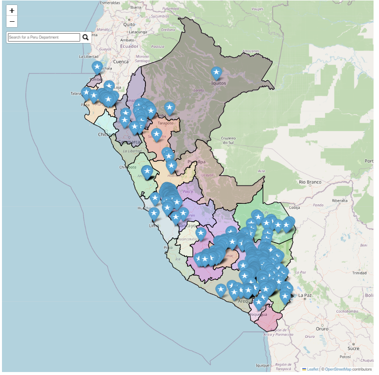

# WSI-PeruDB [](https://zenodo.org/doi/10.5281/zenodo.10558511)
This package allows users to access the Water Stable Isotope Database in Peru. It includes 464 stations over Peru, updated until 2023, and provides an interactive map for exploring the spatial distribution of all the stations. Additionally, it offers features for technical validation and display temporal series for each station and department across Peru.

## How to use it 
First, users need to follow the steps below to access the WSIPeruDB: 

```
pip install WSIPeruDB
```
After that, in order to view the spatial distribution of stable isotope stations, users must run the following script line: 

```
import wsiperudb
wsiperudb.generate_map()
```
<div align="left">
    
  </a>


## GeoJson 
To display comprehensive information about each station on an interactive map, we create a geojson called site_information.geojson file. Additionally, about the peru_departamental_simple.geojson file, we are using it from this [github](https://github.com/juaneladio/peru-geojson) 

## Add data
We encourage users to send their data to the following email address: japaestegui@igp.gob.pe, using the metadata template named 'WSI-PeruDB_template.xlsx' to add their station's information and dataset to the database. Additionally, please include the following details in the email:
- User's Name
- Institution or Company Name
- Country
- Email address

## Download Data
Users must fill the request through this google forms. This is necessary for us to maintain statistics about the database. 
